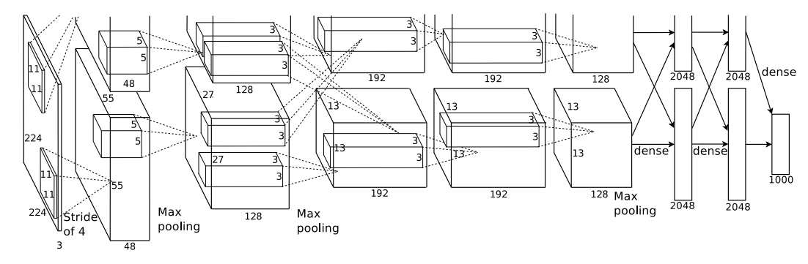

# AlexNet

## The Architecture

### Two GPUs

The authors used two GPU's as the model was too big to fully trained on a single GPU.

> The parallelization scheme that we employ essentially puts half of the kernels (or neurons) on each GPU, with one additional trick: the GPUs communicate only in certain layers. This means that, for example, the kernels of layer 3 take input from all kernel maps in layer 2. However, kernels in layer 4 take input only from those kernel maps in layer 3 which reside on the same GPU.

### ReLU Activation

The model uses ReLu non-linear activation function. The authors found that ReLU activation function gave better results than the tanh function.

### Local Response Normalization

After using the nonlinear activation function, the authors used local response normalization. Denoting by $a_{x, y}^i$ the activity of a neuron computed by applying kernel i at position $(x, y)$ and then applying the ReLU nonlinearity, the response-normalized activity $b_{x, y}^i$ is given by the expression:

$$
b_{x, y}^i = \frac{a_{x, y}^i}{(k + \alpha \sum_{j = \max(0, i - n/2)}^{\min(N-1, i + n/2)} a_{x, y}^j)^{\beta}}
$$

Here the constant (which are hyperparameters) $k$ is set to 2, $\alpha$ is set to $10^{-4}$, $n$ is set to 5, and $\beta$ is set to 0.75. The authors found that this normalization scheme improved the performance of the network.

### Overlapping Pooling

Authors used iverlapping pooling. If we denote the kernel size of the pooling layer as $z\times z$ and the stride as $s$, then setting $s=z$ gives the usual pooling. The authors used $s = 2, z=3$ which gives overlapping pooling.

> This scheme reduces the top-1 and top-5 error rates by 0.4% and 0.3%, respectively, as compared with the non-overlapping scheme s = 2, z = 2, which produces output of equivalent dimensions. We generally observe during training that models with overlapping pooling find it slightly more difficult to overfit.

### Overall Architecture

The net contains eight layers with weights; the first five are convolutional and the remaining three are fullyconnected. The output of the last fully-connected layer is fed to a 1000-way softmax which produces a distribution over the 1000 class labels. Our network maximizes the multinomial logistic regression objective, which is equivalent to maximizing the average across training cases of the log-probability of the correct label under the prediction distribution.

The kernels of the second, fourth, and fifth convolutional layers are connected only to those kernel maps in the previous layer which reside on the same GPU. The kernels of the third convolutional layer are connected to all kernel maps in the second layer. The neurons in the fully connected layers are connected to all neurons in the previous layer. Response-normalization layers follow the first and second convolutional layers. Max-pooling layers, of the kind described above, follow both response-normalization layers as well as the fifth convolutional layer. The ReLU non-linearity is applied to the output of every convolutional and fully-connected layer.

The first convolutional layer has 96 kernels of size $11\times11\times 3$ with stride 4. The input shape is $224\times224\times 3$.

The second convolutional layer has 256 kernels of size $5\times5\times 48$ with stride 1. The input shape is $27\times27\times 48$.

> The third, fourth, and fifth convolutional layers are connected to one another without any intervening pooling or normalization layers. The third convolutional layer has 384 kernels of size 3 × 3 × 256 connected to the (normalized, pooled) outputs of the second convolutional layer. The fourth convolutional layer has 384 kernels of size 3 × 3 × 192 , and the fifth convolutional layer has 256 kernels of size 3 × 3 × 192. The fully-connected layers have 4096 neurons each.

## Reducing Overfitting

A number of methods were used to reduce overfitting. Some are:

### Data Augmentation

> In our implementation, the transformed images are generated in Python code on the CPU while the GPU is training on the previous batch of images. So these data augmentation schemes are, in effect, computationally free. The first form of data augmentation consists of generating image translations and horizontal reflections. We do this by extracting random 224 × 224 patches (and their horizontal reflections) from the 256×256 images and training our network on these extracted patches. This increases the size of our training set by a factor of 2048.

> At test time, the network makes a prediction by extracting five 224 × 224 patches (the four corner patches and the center patch) as well as their horizontal reflections (hence ten patches in all), and averaging the predictions made by the network’s softmax layer on the ten patches.

### Dropout

The authors used dropout in the first to fully connected layers. The dropout rate was set to 0.5.

> At test time, we use all the neurons but multiply their outputs by 0.5, which is a reasonable approximation to taking the geometric mean of the predictive distributions produced by the exponentially-many dropout networks.

### Weight Decay

The authors used weight decay of 0.0005, batch size of 128, and momentum of 0.9. The update rule is:

$$
v_{i+1} = 0.9\times v_i - 0.0005 \times \epsilon \times w_i - \epsilon \times \frac{\partial L}{\partial w_i}\\
w_{i+1} = w_i + v_{i+1}
$$

> We initialized the weights in each layer from a zero-mean Gaussian distribution with standard deviation 0.01. We initialized the neuron biases in the second, fourth, and fifth convolutional layers, as well as in the fully-connected hidden layers, with the constant 1. This initialization accelerates the early stages of learning by providing the ReLUs with positive inputs. We initialized the neuron biases in the remaining layers with the constant 0.

> We used an equal learning rate for all layers, which we adjusted manually throughout training. The heuristic which we followed was to divide the learning rate by 10 when the validation error rate stopped improving with the current learning rate. The learning rate was initialized at 0.01 and reduced three times during training.

## Simplified Architecture

Here, we make some simplifications to the original architecture. We remove the local response normalization, the weight decay as well as the concept of two GPUs. It is also recommended to use a batch size of 32. We'll also avoid different initializaer. We'll use just `glorot` intitialization which works fine. Avoiding these details, the simplified architecture is shown in the tabel:

| Layer          | Input     | Output    | Kernel Size | Stride | Padding | Activation |
| -------------- | --------- | --------- | ----------- | ------ | ------- | ---------- |
| Input          | 224x224x3 | 224x224x3 | -           | -      | -       | -          |
| Conv1          | 224x224x3 | 55x55x96  | 11x11       | 4      | valid   | ReLU       |
| Pool1          | 54x54x96  | 26x26x96  | 3x3         | 2      | 0       | -          |
| Conv2          | 26x26x96  | 26x26x256 | 5x5         | 1      | same    | ReLU       |
| Pool2          | 26x26x256 | 12x12x256 | 3x3         | 2      | 0       | -          |
| Conv3          | 12x12x256 | 12x12x384 | 3x3         | 1      | same    | ReLU       |
| Conv4          | 12x12x384 | 12x12x384 | 3x3         | 1      | same    | ReLU       |
| Conv5          | 12x12x384 | 12x12x256 | 3x3         | 1      | same    | ReLU       |
| Pool3          | 12x12x256 | 5x5x256   | 3x3         | 2      | 0       | -          |
| Flatten        | 5x5x256   | 6400      | -           | -      | -       | -          |
| FC1            | 6400      | 4096      | -           | -      | -       | ReLU       |
| Dropout1 (0.5) | 4096      | 4096      | -           | -      | -       | -          |
| FC2            | 4096      | 4096      | -           | -      | -       | ReLU       |
| Dropout1 (0.5) | 4096      | 4096      | -           | -      | -       | -          |
| FC3            | 4096      | 1000      | -           | -      | -       | Softmax    |

Total number of parameters are 50,844,008
