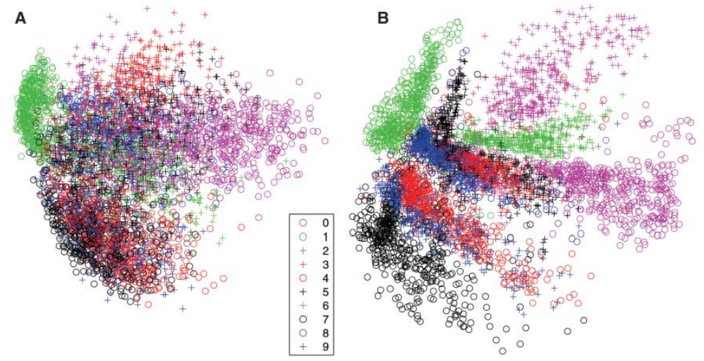

# Autoencoder

High-dimensional data can be converted to low-dimensional codes by training a multilayer neural network with a small central layer to reconstruct high-dimensional input vectors. The authors describe an effective way of initializing the weights that allows deep autoencoder networks to learn low-dimensional codes that work much better than principal components analysis as a tool to reduce the dimensionality of data.

## Introduction

The idea is to use two neural networks, one to encode the input data into a low-dimensional code, and another to decode the code back into the original input data. The two networks are trained together to minimize the difference between the input data and the output data. The authors call this a _deep autoencoder_.

The layer which learns the encoding is the bottleneck layer as it is the layer with the smallest number of neurons. The authors call this layer the _code layer_.

The authors created such networks. They also discussed that it is necessary to have a network which has weights closer to a good solution. For this, they used a pretraining step. Here, we will not discuss the pretraining step.

The paper followed by doing some comprarison between the autoencoder and PCA. The authors found that the autoencoder is better than PCA.

**A** is for PCA and **B** is for Autoencoder.

## Implementation

This time, we will not create a class of autoencoder. This is done because we can not have a _general_ autoencoder. Instead, we will create some autoencoders by using dense and convolutional layers. The goal will be to make a comparison between the two. We will use MNIST, Fashion MNIST and CIFAR-10 datasets.

### Architecture Details

#### Dense Autoencoder

Here, the architecture is divided into three different networks:

1. **encoder:** This will encode the information. The model will compose of a number of given neurons. (Passed as list of integers.)
2. **bottleneck:** This will give the encoding. Give an integer which represents number of neurons.
3. **decoder:** This will decode the result given by encoder. The number of layers and neurons is decided by what given in the encoder.

> I've merged the `bottleneck` to the `encoder`. This way, calling the `encoder` model gives the encoding.

#### Convolution Autoencoder

Here, the networks are made up of a series of block. Each block has two conv layer for encoder (or conv transpose for decoder) and one pooling layer (or upsampling layer for decoder). The kernel size is 3, stride 1 and padding same for the conv layers. For pooling and upsampling, stride of 2 is used. The number of kernels starts with 32 and doubles after each block.
