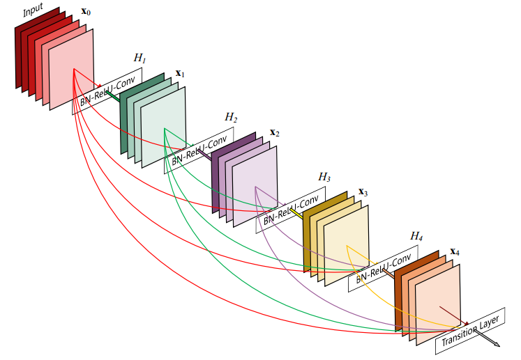
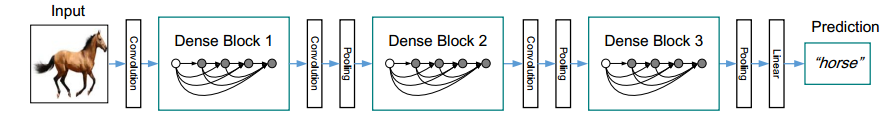
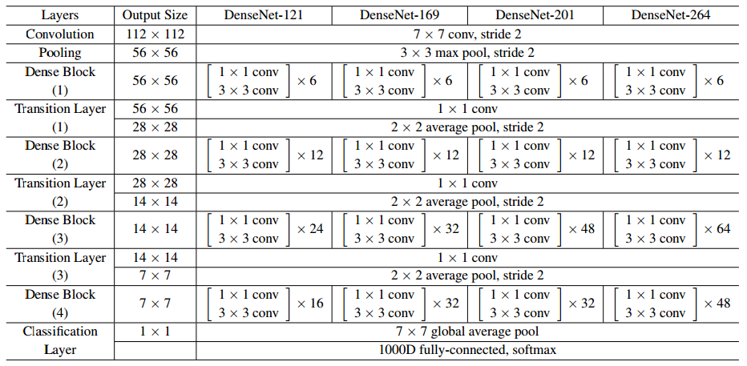

# DenseNet

## Motivation

As CNNs become increasingly deep, a new research problem emerges: as information about the input or gradient passes through many layers, it can vanish and “wash out” by the time it reaches the end (or beginning) of the network. There has been a number of proposed solutions to this problem, including residual networks, highway networks, and dense connections, which we will discuss here.

> In this paper, we propose an architecture that distills this insight into a simple connectivity pattern: to ensure maximum information flow between layers in the network, we connect all layers (with matching feature-map sizes) directly with each other. To preserve the feed-forward nature, each layer obtains additional inputs from all preceding layers and passes on its own feature-maps to all subsequent layers.

Unlike in ResNet, authors in DenseNet do not use skip connections, but instead concatenate the feature maps from all previous layers. Hence, the $l^{th}$ layer has $l$ inputs consisting of feature maps from all previous layers. Its own features are passed to all $L-l$ subsequent layers. This introduces $\frac{L(L+1)}{2}$ connections to a $L$ layer network, unlike ResNet which has $L$ connections.

At first, it might see that all these new connections will result in more parameters. However, the authors argued that unlike other architectures, DenseNet does not need very high number of filters. This is because the feature maps from all previous layers are concatenated, and hence the model does not need to learn redundant feature-maps.

DenseNet layers are very narrow (e.g., 12 filters per layer), adding only a small set of feature-maps to the “collective knowledge” of the network and keep the remaining featuremaps unchanged—and the final classifier makes a decision based on all feature-maps in the network.

Each layer has direct access to the gradients from the loss function and the original input signal, leading to an implicit deep supervision. This helps training of deeper network architectures. Further, we also observe that dense connections have a regularizing effect, which reduces overfitting on tasks with smaller training set sizes.

## Architecture

There are a few key components to DenseNet which we need to discuss.

### ResNets

In ResNet, the mapping is like this:

$$
x_l = H_l(x_{l-1}) + x_{l-1}
$$

Keep this in mind as we discuss DenseNet.

### Dense Connections

As discussed above, the $l^{th}$ layer has $l$ inputs consisting of feature maps from all previous layers. So, we have:

$$
x_l = H_l([x_{0}, x_{1}, \dots, x_{l-1}])
$$

here, $[x_{0}, x_{1}, \dots, x_{l-1}]$ is the concatenation of all previous layers.

### Composite Function

The function $H_l$, the composite function, is made up by three layers: batch normalization, ReLU, and 3x3 convolution.

### Pooling Layers

The concatenation operation used in above equation is not viable when the size of feature-maps changes. However, an essential part of convolutional networks is down-sampling layers that change the size of feature-maps. To facilitate down-sampling in our architecture we divide the network into multiple densely connected dense blocks; see Figure 2. We refer to layers between blocks as transition layers, which do convolution and pooling. The transition layers used in our experiments consist of a batch normalization layer and an 1×1 convolutional layer followed by a 2×2 average pooling layer.

### Growth Rate

The hyperparameter $k$ is called the growth rate. It controls the number of new feature-maps that are generated in each layer. Some values of $k$ are 12, 24, 32 etc.. The reason why such a low number of filters are used is, as the article states:

> One explanation for this is that each layer has access to all the preceding feature-maps in its block and, therefore, to the network’s “collective knowledge”. One can view the feature-maps as the global state of the network. Each layer adds k feature-maps of its own to this state. The growth rate regulates how much new information each layer contributes to the global state. The global state, once written, can be accessed from everywhere within the network and, unlike in traditional network architectures, there is no need to replicate it from layer to layer

### Bottleneck Layers

Though each layer produces just $k$ filters, the input to the layer has many filters. To reduce the cost, we can use a bottleneck layer. This is a 1x1 convolutional layer that reduces the number of feature-maps to $4k$ and then expands it back to $k$ using 3x3 convolutional layer. This is called a bottleneck layer. The sequence of the layers is: BN-RELU-CONV(1x1)-BN-RELU-CONV(3x3). These type of architecture was named DenseNet-B.

### Compression

> To further improve model compactness, we can reduce the number of feature-maps at transition layers. If a dense block contains m feature-maps, we let the following transition layer generate $\lfloor\theta m\rfloor$ output featuremaps, where $0 < \theta \le 1$ is referred to as the compression factor. When $\theta=1$, the number of feature-maps across transition layers remains unchanged. We refer the DenseNet with $\theta \le 1$ as DenseNet-C, and we set $\theta = 0.5$ in our experiment. When both the bottleneck and transition layers with $\theta \le 1$ are used, we refer to our model as DenseNet-BC.

### More Details

The input shape is $224\times224$. The initial convolution layer comprises 2k convolutions of size 7×7 with stride 2; the number of feature-maps in all other layers also follow from setting k. They use 1x1 convolution followed by 2x2 average pooling with a stride of 2 as transition layers. The number of feature-maps in the transition layers is $\lfloor\theta m\rfloor$ where $m$ is the number of feature-maps in the previous layer. The authors use $\theta = 0.5$. Padding used in 3x3 kernels is 1.

The architecture is as follows:

### Training

All the networks are trained using stochastic gradient descent (SGD). On CIFAR and SVHN we train using batch size 64 for 300 and 40 epochs, respectively. The initial learning rate is set to 0.1, and is divided by 10 at 50% and 75% of the total number of training epochs. On ImageNet, we train models for 90 epochs with a batch size of 256. The learning rate is set to 0.1 initially, and is lowered by 10 times at epoch 30 and 60. , we use a weight decay of 1e-4 and a Nesterov momentum of 0.9 without dampening. We adopt the weight initialization introduced by He et al.

## Implementation Details

The Dense Block is implemnted in `ReVision.blocks` module. This block is then used to create the variuos DenseNet architectures. To build a model, you need to provide the following parameters:

- `size`: The size to use. This control how deep the modelwill be. DenseNet has four variants: `121`, `169`, `201`, `264`. The size of the model is determined by the number of layers in each block. Instead of passing these numbers as argument, you meed to just specify integers `1`, `2`, `3`, `4`. The default value is `1`. The number of blocks to repeat in a `DenseBlock` is determined by the size of the model. For example, for `size=1`, the number of blocks is `[6, 12, 24, 16]` and for `size=2`, the number of blocks is `[6, 12, 32, 32]`. The number of blocks for other sizes are `[6, 12, 48, 32]`, `[6, 12, 64, 48]` respectively.
- `k`: This is the growth rate. The default value is `12`. Other, suggested values are `24`, `32`. Less than `12` is not accepeted and will raise an error.
- `theta`: This is the compression factor. The default value is `0.5`. Other, suggested values are `1`, `0.25`, `0.75`. Note that it must lie between 0 and 1. (0 is not allowed as it will lead to zero feature maps in the transition layer.) It is recommended that `theta` be a number in form of $\frac{1}{2^p}$.

### Naming Convention

The authors have used `DenseNetB` when the Dense Block is implemented with 1x1 kernels. Here, all the dense blocks are implemented with 1x1 kernels. So, the naming convention is `DenseNetB`. The authors have used `DenseNetBC` when `theta` was less than 1. This convention is followed here. Furthermore, This base name is followed by the number of layers (one of `121`, `169`, `201`, `264`) and the growth rate. For example, `DenseNetC121_12` is a DenseNet with 121 layers, growth rate 12. Another example is `DenseNetBC121_12_0.5` is a DenseNet with 121 layers, growth rate 12 and compression factor 0.5.
