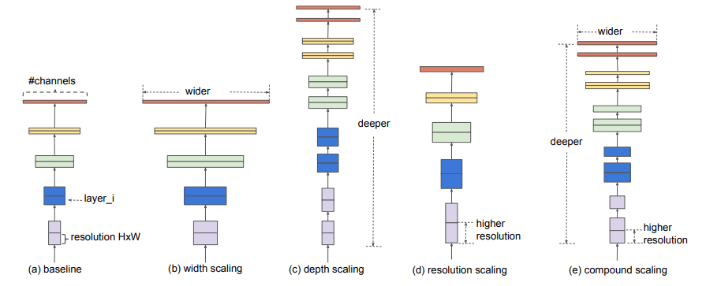
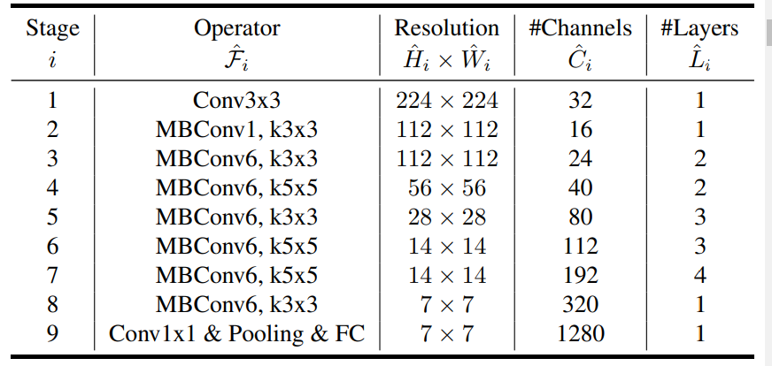

# EfficientNet

## Motivation

Scaling up a CovNet is one of the main way to achieve better accurcay. There are mainly three ways, this scaling can be done:

1. **Depth:** This is the most common way to scale a CovNet. For this, we increase the number of layers for example: ResNet. The intuition is that deeper ConvNet can capture richer and more complex features, and generalize well on new tasks.
2. **Width:** In this method, the number of filters of the model is increased. Wider networks tend to be able to capture more fine-grained features and are easier to train. However, extremely wide but shallow networks tend to have difficulties in capturing higher level features.
3. **Resolution:** Increasing the resolution of the input image is another way to scale a CovNet. With higher resolution input images, ConvNets can potentially capture more fine-grained patterns

Usually, it is common to scale only one of the three dimensions – depth, width, and image size. Though it is possible to scale two or three dimensions arbitrarily, arbitrary scaling requires tedious manual tuning and still often yields sub-optimal accuracy and efficiency. The idea behind the EfficientNet is to scale all three dimensions in an efficient way.

> Our empirical study shows that it is critical to balance all dimensions of network width/depth/resolution, and surprisingly such balance can be achieved by simply scaling each of them with constant ratio. Based on this observation, we propose a simple yet effective compound scaling method. Unlike conventional practice that arbitrary scales these factors, our method uniformly scales network width, depth, and resolution with a set of fixed scaling coefficients.

For example, say we want to use $2^N$ times more computational resources. Then, we can simply increase the network depth by $\alpha^N$, the network width by $\beta^N$, and the resolution by $\gamma^N$, where $\alpha$, $\beta$, and $\gamma$ are the fixed scaling coefficients. This is the compound scaling method. Intuitively, the compound scaling method makes sense because if the input image is bigger, then the network needs more layers to increase the receptive field and more channels to capture more fine-grained patterns on the bigger image.

The authors showed that there scaling method works well on existing architectures like ResNet, DenseNet, and MobileNet. The authors also showed that the scaling method works well on the new architecture EfficientNet which is the second main contribution of this paper. For this, they used neural architecture search (NAS) to find the best architecture for the scaling method.

> Recently, neural architecture search becomes increasingly popular in designing efficient mobile-size ConvNets, and achieves even better efficiency than hand-crafted mobile ConvNets by extensively tuning the network width, depth, convolution kernel types and sizes. However, it is unclear how to apply these techniques for larger models that have much larger design space and much more expensive tuning cost.

## Compound Scaling Method

> We empirically observe that different scaling dimensions are not independent. Intuitively, for higher resolution images, we should increase network depth, such that the larger receptive fields can help capture similar features that include more pixels in bigger images. Correspondingly, we should also increase network width when resolution is higher, in order to capture more fine-grained patterns with more pixels in high resolution images. These intuitions suggest that we need to coordinate and balance different scaling dimensions rather than conventional single-dimension scaling.

Here is the scaling method: The authors introduced a parameter $\phi$, by which we can control the scaling of the network. The scaling method is as follows:

$$
\begin{aligned}
\text{depth} &= \alpha^ \phi \\
\text{width} &= \beta^ \phi \\
\text{resolution} &= \gamma ^\phi\\
\text{s.t. } & \alpha \beta^2 \gamma^2 \approx 2\\
&\alpha \ge 1, \beta \ge 1, \gamma \ge 1
\end{aligned}
$$

Here $\alpha, \beta \gamma$ are constants and can be determined using a small grid search. $\phi$ is a user-specified parameter which tells how much more resources we want to use while $\alpha, \beta \gamma$ tells how to apply these resources. The total FLOPS is proprtional to $(\alpha \beta^2 \gamma^2)^{\phi}$, and as $\alpha \beta^2 \gamma^2\approx 2$, the total FLOPS is proportional to $2^{\phi}$.

## The EfficientNet Architecture

The authors first developed a baseline model, calling it EfficientNet-B0. This model is a variant of the MobileNetV2 architecture. The authors then used NAS to find the best architecture for the scaling method.

The main building block of the model is the **MBConv** block. This block is a variant of the inverted residual block, to which they also add **squeeze-and-excitation** optimization. Starting from the baseline, the authors applied the scaling method to the baseline model to get the EfficientNet-B1, B2, B3, B4, B5, B6, and B7 models. The scaling method was determined using these two step:

1. Furst, they fixed $\phi=1$ assuming that twice as much computational resources are available. Then, they used a grid search to find the best $\alpha, \beta, \gamma$ for each model. They found these values: $\alpha=1.2, \beta=1.1, \gamma=1.15$.
2. Then, they fixed $\alpha=1.2, \beta=1.1, \gamma=1.15$ and used the above equation to find the values of $d, w, r$.

> Notably, it is possible to achieve even better performance by searching for $\alpha, \beta, \gamma$ directly around a large model, but the search cost becomes prohibitively more expensive on larger models. Our method solves this issue by only doing search once on the small baseline network (step 1), and then use the same scaling coefficients for all other models (step 2).
