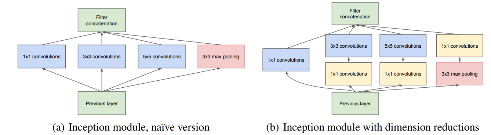
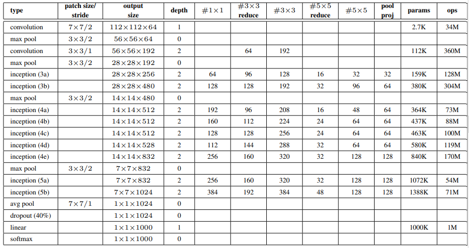
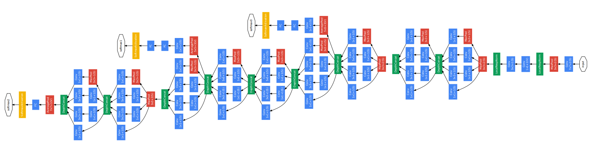

# Inception

## Motivation

Most progress in field of image recognition and object detection is not just the result of more powerful hardware, larger datasets and bigger models, but mainly a consequence of new ideas, algorithms and improved network architectures.

> Our GoogLeNet submission to ILSVRC 2014 actually uses 12× fewer parameters than the winning architecture of Krizhevsky et al (AlexNet) from two years ago, while being significantly more accurate. The biggest gains in object-detection have not come from the utilization of deep networks alone or bigger models, but from the synergy of deep architectures and classical computer vision.

In our case, the word 'deep' is used in two different meanings: first of all, in the sense that we introduce a new level of organization in the form of the 'Inception module' and also in the more direct sense of increased network depth.

The most straightforward way of improving the performance of deep neural networks is by increasing their size. This includes both increasing the depth – the number of levels – of the network and its width: the number of units at each level. However, there are two drawbacks:

1. The number of parameters grows and the model becomes susceptible to overfitting.
2. Increase in parameters also increases the computational cost.

The fundamental way of solving both issues would be by ultimately moving from fully connected to sparsely connected architectures, even inside the convolutions. This has a benefit of reducing the number of parameters and also the computational cost and it also mimics the biological system. However, todays computing infrastructures are very inefficient when it comes to numerical calculation on non-uniform sparse data structures. Even if the number of arithmetic operations is reduced by 100×, the overhead of lookups and cache misses is so dominant that switching to sparse matrices would not pay off.

The Inception model is a way to realize this sparse connectivity in a computationally efficient way. The architecture proposed by the authors perfoms very well. However, they are not sure if this is because of this 'sparse' architecture or some other reason.

> One must be cautious though: although the proposed architecture has become a success for computer vision, it is still questionable whether its quality can be attributed to the guiding principles that have lead to its construction.

## The Architecture

> The main idea of the Inception architecture is based on finding out how an optimal local sparse structure in a convolutional vision network can be approximated and covered by readily available dense components. Note that assuming translation invariance means that our network will be built from convolutional building blocks. All we need is to find the optimal local construction and to repeat it spatially.

The Inception module is a building block of the network. It uses 3x3, 5x5 and 1x1 convolution together. The number of kernels must increase at higher depth and the implementation, in in naive form, would look be very inefficient. The authors propose a way to reduce the number of parameters and the computational cost.

The above figure shows both the architectures. The idea is to judiciously apply 1x1 kernels to decrease the computational requirements.

> An Inception network is a network consisting of modules of the above type stacked upon each other, with occasional max-pooling layers with stride 2 to halve the resolution of the grid. For technical reasons (memory efficiency during training), it seemed beneficial to start using Inception modules only at higher layers while keeping the lower layers in traditional convolutional fashion. This is not strictly necessary, simply reflecting some infrastructural inefficiencies in our current implementation.

Authors have found that all the included the knobs and levers allow for a controlled balancing of computational resources that can result in networks that are 2 − 3× faster than similarly performing networks with non-Inception architecture, however this requires careful manual design at this point.

### GoogLeNet

The authors use GoogLeNet to refer to the particular incarnation of the Inception architecture used in our submission for the competition.

The table describes the architecture of GoogLeNet. The first 3 layers are the same as AlexNet. The next 5 layers are the Inception modules. The last 2 layers are the same as AlexNet.

All the convolutions, including those inside the Inception modules, use rectified linear activation. The size of the receptive field in our network is 224×224 taking RGB color channels with mean subtraction. “#3×3 reduce” and “#5×5 reduce” stands for the number of 1×1 filters in the reduction layer used before the 3×3 and 5×5 convolutions. One can see the number of 1×1 filters in the projection layer after the built-in max-pooling in the pool proj column. All these reduction/projection layers use rectified linear activation as well.

### The Side Classifier

Even a relatively small network performs quite good at classification and hence the authors have added a side classifier to the network. By adding auxiliary classifiers connected to these intermediate layers, we would expect to encourage discrimination in the lower stages in the classifier, increase the gradient signal that gets propagated back, and provide additional regularization

These classifiers take the form of smaller convolutional networks put on top of the output of the Inception (4a) and (4d) modules. During training, their loss gets added to the total loss of the network with a discount weight (the losses of the auxiliary classifiers were weighted by 0.3). At inference time, these auxiliary networks are discarded. The exact architecture of the auxiliary classifiers is:

- An average pooling layer with 5×5 filter size and stride 3, resulting in an 4×4×512 output for the (4a), and 4×4×528 for the (4d) stage.
- A 1×1 convolution with 128 filters for dimension reduction and rectified linear activation.
- A fully connected layer with 1024 units and rectified linear activation.
- A dropout layer with 70% ratio of dropped outputs.
- A linear layer with softmax loss as the classifier (predicting the same 1000 classes as the main classifier, but removed at inference time).

### Training

The authors used SGD with 0.9 momentum with fixed learning schedule. They decreased the learning rate by 4% every 8 epoch.

> We independently trained 7 versions of the same GoogLeNet model (including one wider version), and performed ensemble prediction with them. These models were trained with the same initialization (even with the same initial weights, mainly because of an oversight) and learning rate policies, and they only differ in sampling methodologies and the random order in which they see input images

## Implementation

We will make some simplifications in the implementation. We will use the same architecture as GoogLeNet, but we will not use the side classifier.

The models implemented are:

1. `GoogLeNet` - The original GoogLeNet architecture.
