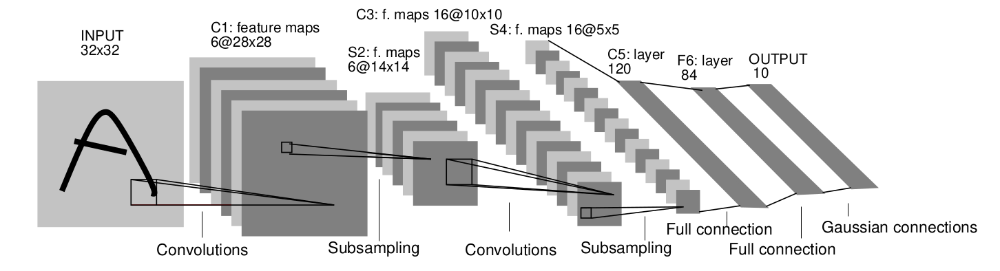
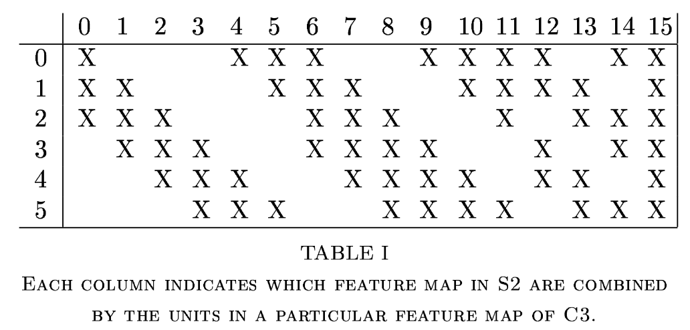

# LeNet

## The Architecture

### LeNet-5 (Original)

Here is a picture of the original architecture given in the paper.

LeNet-5 consist of 7 layers, without the input layer. The input size is $32\times32$ and the digits are mostly have shapes from $20\times20$ to $28\times 28$, centered around the origin. The input is normalized so that the background corresponds to -0.1 and foreground to 1.175. This is done by **normalizing** the input.

The first layer $C1$ is a **convolution** layer with kernel size of $5\times 5$ and there are 6 such kernels. The output of the feature map is $28\times 28$. (This can be realized by using a **valid** padding and strude of 1). The layer has 156 trainable parameters.

Second layer is $S2$, which is a **pooling layer** which gives an output feature map of $14\times14$. This uses a kernel size of $2\times 2$ and a stride of $2$. Note that the four output are added, multiplied by a trainable coefficents and then are added to a trainable bias. The final result is passed through a sigmoid. This is called **subsampling**. The layer has 12 trainable parameters.

The layer $C3$ is a convolution layer with kernel size of $5\times 5$ and there are 16 such kernels. The difference here is that not all the feature maps of $C3$ are connected with all the feature maps of $S2$. The reason behind this is to decrease the number of parameters as well as to _try to break a symmetry_.

The figure shows that the first 6 C3 features are connected by the first three S2 features, the next 6 C3 features are connected by the next four S2 features, the next three are connected by four features and the last is connected by all S3 features. The layer C3 has 1516 trainable parameters and the output feature map has shape of $10\times10$.

The layer $S4$ is a subsampling layer with kernel size of $2\times2$ and stride of $2$. The output feature map has shape of $5\times5$. The layer has 32 trainable parameters.

The layer C5 is a convolution layer with 120 feature maps and a kernel size of $5\times5$. Since the output of S4 is $5\times5$, the output of C5 is $1\times1$. This means that there is a full connection between the output of S4 and the input of C5. The layer has 48120 trainable parameters. (This is like fully connected layer with 120 neurons). The layer has 48120 trainable parameters.

The F6 layer is a fully connected layer with 84 neurons. The layer has 10164 trainable parameters. Scaled _tanh_ is used as the activation function here. In fact, the function used is

$$
f(x) = 1.7159\tanh(Sx)
$$

The output layer is chosen to be Euclidean Radial Basis Function (RBF) one for each neurons with 84 inputs each. The output is a vector of 10 elements. The layer has 850 trainable parameters. The output $y_i$ is given by

$$
y_i = \sum_{j=1}^{84} w_{ij} (x_j - w_{ij})^2
$$

So, the output of RBF can be understood as the distance between the input and the weights. The larger away the input is from the weights, the larger the output is. This can be interpreted as the negative log likelihood of the input being the class $i$.

The loss function is the sum of the squared error between the output and the target. The target is a one-hot vector.

### LeNet-5 (Modified 1)

Here, we'll use a modified version of LeNet-5 to make the classification. First, we are not going to multiply the output of the pooling layers. In C3, we are using full connection. After C5, we are flattening the output and using a fully connected layer with 84 neurons. The output layer is a fully connected layer with 10 neurons. The activation function is softmax. The activation functions used in the layers are going to be ReLU. The loss function is going to be cross entropy.

### LeNet-5 (Modified 2)

Instead of averaging the output of the pooling layers, we are going to use max pooling. The input is going to be changed from $32\times32$ to $28\times 28$. To have the other layers unchanged, we are going to use **same** padding. (This is basically the same as using an input of $32\times32$ with **valid** padding).
