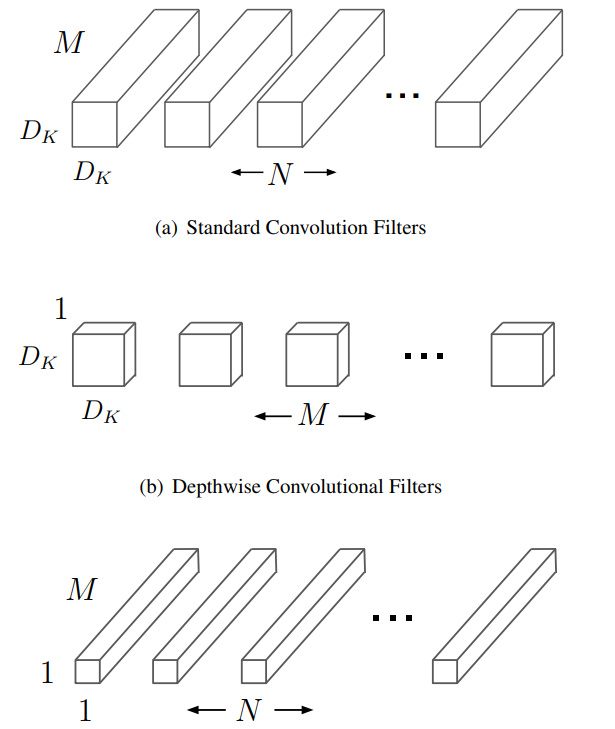
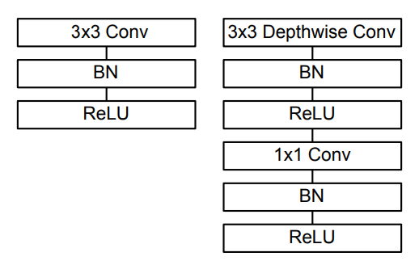
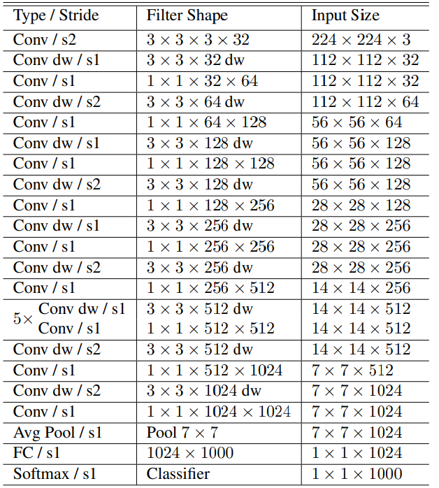

# MobileNet

## Motivation

MobileNets are based on a streamlined architecture that uses depthwise separable convolutions to build light weight deep neural networks. We introduce two simple global hyperparameters that efficiently trade off between latency and accuracy.

Larger model is not always the solution to better model. In many real world applications such as robotics, self-driving car and augmented reality, the recognition tasks need to be carried out in a timely fashion on a computationally limited platform.

There has been rising interest in building small and efficient neural networks in the recent literature,. Many different approaches can be generally categorized into either compressing pretrained networks or training small networks directly. This paper proposes a class of network architectures that allows a model developer to specifically choose a small network that matches the resource restrictions (latency, size) for their application.

## Architecture

MobileNet is build on depthwise separable filters.

### Depthwise Separable Convolution

Depthwise separable convolutions which is a form of factorized convolutions which factorize a standard convolution into a depthwise convolution and a 1×1 convolution called a pointwise convolution. For MobileNets the depthwise convolution applies a single filter to each input channel. The pointwise convolution then applies a 1×1 convolution to combine the outputs the depthwise convolution. A standard convolution both filters and combines inputs into a new set of outputs in one step. The depthwise separable convolution splits this into two layers, a separate layer for filtering and a separate layer for combining. This factorization has the effect of drastically reducing computation and model size.

To see this, consider the fact that a standard convolution layer takes as input a $D_F\times D_F\times M$ feature map $\mathbf{F}$ and produces a $D_F\times D_F\times N$ feature map $\mathbf{G}$. The number of parameters is $D_K\times D_K \times M\times N$ while number of multiplication the network performs is $D_K\times D_K \times M\times N\times D_F\times D_F$.

As for the depthwise separable convolution, the depthwise convolution takes as input a $D_F\times D_F\times M$ feature map $\mathbf{F}$ and produces a $D_F\times D_F\times M$ feature map $\mathbf{G}$. The number of parameters is $D_K\times D_K\times M$ while number of multiplication the network performs is $D_K\times D_K\times M\times D_F\times D_F$. The pointwise convolution takes as input a $D_F\times D_F\times M$ feature map $\mathbf{G}$ and produces a $D_F\times D_F\times N$ feature map $\mathbf{H}$. The number of parameters is $M\times N$ while number of multiplication the network performs is $M\times N\times D_F\times D_F$. So, the total number of parameters is $D_K\times D_K\times M + M\times N$ while the total number of multiplications is $D_K\times D_K\times M\times D_F\times D_F + M\times N\times D_F\times D_F$.

So, the reduction is computation cost is:

$$
\frac{D_K\times D_K\times M\times D_F\times D_F + M\times N\times D_F\times D_F}{D_K\times D_K \times M\times N\times D_F\times D_F}\\
\approx \frac{1}{N} + \frac{1}{D_K^2}
$$

MobileNet uses 3 × 3 depthwise separable convolutions which uses between 8 to 9 times less computation than standard convolutions at only a small reduction in accuracy.

### Network Structure

All layers are followed by a batchnorm and ReLU nonlinearity with the exception of the final fully connected layer which has no nonlinearity and feeds into a softmax layer for classification. Down sampling is handled with strided convolution in the depthwise convolutions as well as in the first layer. A final average pooling reduces the spatial resolution to 1 before the fully connected layer. Counting depthwise and pointwise convolutions as separate layers, MobileNet has 28 layers.

The figure below shows the general structure of one layer.

Here is the model architecture:

> 1×1 convolutions do not require this reordering in memory and can be implemented directly with general matrix multiply (GEMM) which is one of the most optimized numerical linear algebra algorithms. MobileNet spends 95% of it’s computation time in 1 × 1 convolutions which also has 75% of the parameters.

The models were trained using gradient descent similar to Inception V3. Very little to no weight decay was used.

### Width Multiplier: Thinner Models

The authors introduced a parameter $\alpha$ which is responsible for _thinning_ the model. For a given layer and width multiplier $alpha$, the number of input channels $M$ becomes $\alpha M$ and the number of output channels becomes $\alpha N$.

Width multiplier has the effect of reducing computational cost and the number of parameters quadratically by roughly $\alpha^2$ . Width multiplier can be applied to any model structure to define a new smaller model with a reasonable accuracy, latency and size trade off.

### Resolution Multiplier: Reduced Representation

Authors also introduced another parameter, the resolution multiplier $\rho$ which is used to change the resolution of the input image. The value of $\rho$ is chosen such that the input shape becomes one of the 224, 192, 160 or 128.

$\rho = 1$ is the baseline MobileNet and $\rho < 1$ are reduced computation MobileNets. Resolution multiplier has the effect of reducing computational cost by $\rho^2$.

## Implementation

Very few modifications are made during the implementation. In the module, the model can be build by either passing the name or by passing the values of $\alpha$ and $\rho$. See that note below:

> **Naming a model:** The autors used `alpha-MobileNet-rho` to name a model. eg. `0.75MobileNet-128` is for $\alpha=0.75$ and $\rho = 0.57$. For my implementation, I'll using a name in the formate of `alpha_MobileNet_rho` where alpha is a float and rho is string taking values from ["baseline", "medium", "small", "tiny"]. So, `0.75_MobileNet_medium` is for $\alpha=0.75$ and $\rho = 0.57$.
