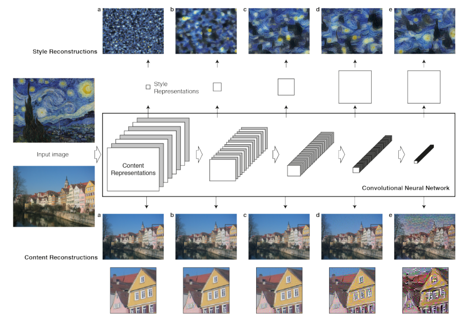
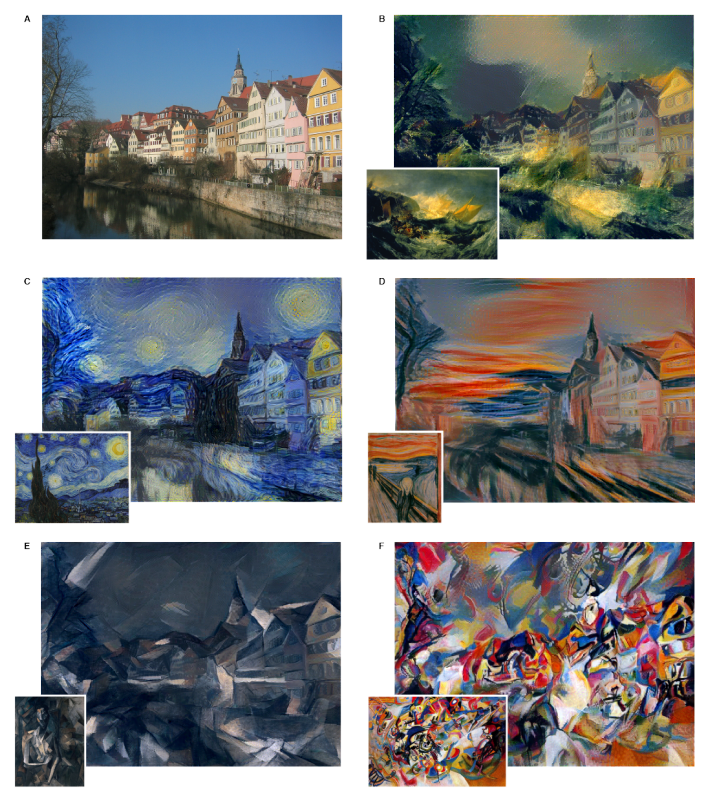
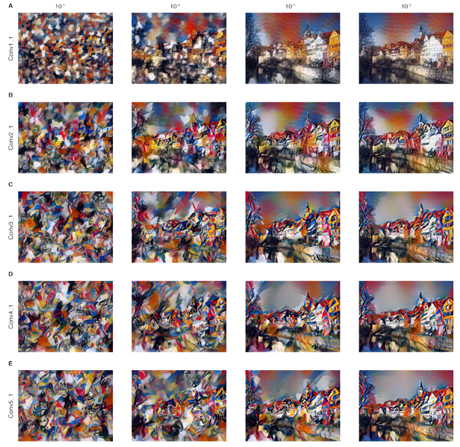

# Neural Style Transfer

> Here we introduce an artificial system based on a Deep Neural Network that creates artistic images of high perceptual quality. The system uses neural representations to separate and recombine content and style of arbitrary images, providing a neural algorithm for the creation of artistic images.

## Motivation

The idea is that the features learned by convolution kernels can be used to separate the content and style of an image. The content of an image is the high level features that are learned by the convolution kernels. The style of an image is the low level features that are learned by the convolution kernels. So, we can separate the content and style of an image and then recombine them to create a new image.

Along the processing hierarchy of the network, the input image is transformed into representations that increasingly care about the actual content of the image compared to its detailed pixel values. We can directly visualise the information each layer contains about the input image by reconstructing the image only from the feature maps in that layer. Higher layers in the network capture the high-level content in terms of objects and their arrangement in the input image but do not constrain the exact pixel values of the reconstruction. (Fig 1, content reconstructions d,e). In contrast, reconstructions from the lower layers simply reproduce the exact pixel values of the original image (Fig 1, content reconstructions a,b,c). We therefore refer to the feature responses in higher layers of the network as the content representation.

To obtain a representation of the style of an input image, we use a feature space originally designed to capture texture information. This feature space is built on top of the filter responses in each layer of the network. It consists of the correlations between the different filter responses over the spatial extent of the feature maps (see Methods for details). By including the feature correlations of multiple layers, we obtain a stationary, multi-scale representation of the input image, which captures its texture information but not the global arrangement.

A given input image is represented as a set of filtered images at each processing stage in the CNN. While the number of different filters increases along the processing hierarchy, the size of the filtered images is reduced by some downsampling mechanism (e.g. max-pooling) leading to a decrease in the total number of units per layer of the network. Content Reconstructions. We can visualise the information at different processing stages in the CNN by reconstructing the input image from only knowing the network"s responses in a particular layer. We reconstruct the input image from from layers "conv1 1" (a), "conv2 1" (b), "conv3 1" (c), "conv4 1" (d) and "conv5 1" (e) of the original VGG-Network. We find that reconstruction from lower layers is almost perfect (a,b,c). In higher layers of the network, detailed pixel information is lost while the high-level content of the image is preserved (d,e). Style Reconstructions. On top of the original CNN representations we built a new feature space that captures the style of an input image. The style representation computes correlations between the different features in different layers of the CNN. We reconstruct the style of the input image from style representations built on different subsets of CNN layers ( "conv1 1" (a), "conv1 1" and "conv2 1" (b), "conv1 1", "conv2 1" and "conv3 1" (c), "conv1 1", "conv2 1", "conv3 1" and "conv4 1" (d), "conv1 1", "conv2 1", "conv3 1", "conv4 1" and "conv5 1" (e)). This creates images that match the style of a given image on an increasing scale while discarding information of the global arrangement of the scene.

Indeed reconstructions from the style features produce texturised versions of the input image that capture its general appearance in terms of colour and localised structures. Moreover, the size and complexity of local image structures from the input image increases along the hierarchy, a result that can be explained by the increasing receptive field sizes and feature complexity. We refer to this multi-scale representation as style representation.

> The key finding of this paper is that the representations of content and style in the Convolutional Neural Network are separable. That is, we can manipulate both representations independently to produce new, perceptually meaningful images.

The images are synthesised by finding an image that simultaneously matches the content representation of the photograph and the style representation of the respective piece of art. Effectively, this renders the photograph in the style of the artwork, such that the appearance of the synthesised image resembles the work of art, even though it shows the same content as the photograph.

The visually most appealing images are usually created by matching the style representation up to the highest layers in the network. Of course, image content and style cannot be completely disentangled. A strong emphasis on style will result in images that match the appearance of the artwork, effectively giving a texturised version of it, but hardly show any of the photograph"s content (Fig 3, first column). When placing strong emphasis on content, one can clearly identify the photograph, but the style of the painting is not as well-matched (Fig 3, last column). For a specific pair of source images one can adjust the trade-off between content and style to create visually appealing images.

## Methods

For image synthasis, the authors replaced the max-pooling layers in the VGG-19 network with average-pooling layers. This allows us to use the network to propagate the gradient easily.

### Content Representation

A layer with $N_l$ distinct filters has $N_l$ feature maps each of size $M_l$ , where $M_l$ is the height times the width of the feature map. So the responses in a layer $l$ can be stored in a matrix $F^l \in \mathbb{R}^{N_l\times M_l}$ where $F_l^{ij}$ is the activation of the i$^{th}$ filter at position $j$ in layer $l$. To visualise the image information that is encoded at different layers of the hierarchy (Fig 1, content reconstructions) we perform gradient descent on a white noise image to find another image that matches the feature responses of the original image. So, assuming $\vec{p}$ and $\vec{x}$ be the original image and the image that is generated and $P^l$ and $F^l$ their respective feature representation in layer $l$: the content loss is defined as:

$$
\begin{align*}
\mathcal{L}_{\text{content}}(\vec{p}, \vec{x}, l) &=\sum_{ij}(F^l_{ij}-P^l_{ij})^2
\end{align*}
$$

Thus we can change the initially random image $\vec{x}$ until it generates the same response in a certain layer of the CNN as the original image $\vec{p}$. The five content reconstructions in Fig 1 are from layers "conv1 1" (a), "conv2 1" (b), "conv3 1" (c), "conv4 1" (d) and "conv5 1" (e) of the original VGG-Network

### Style Representation

For style representation, the authors built a new feature space on top of the feature maps in each layer of the network. The feature space consists of the correlations between the different filter responses over the spatial extent of the feature maps. The authors used the Gram matrix to compute the correlations between the different feature maps in a layer. The Gram matrix is defined as:

$$
\begin{align*}
G^l_{ij} &= \sum_{k}F^l_{ik}F^l_{jk}
\end{align*}
$$

where $F^l_{ik}$ is the activation of the i$^{th}$ filter at position $k$ in layer $l$. This means that the gram matrix $G^l\in \mathbb{R}^{N_l\times N_l}$ is the inner product between the feature maps in layer $l$. Same as before, the authors used gradient descent to find an image that matches the style representation of the original image. The style loss is defined as:

$$
\begin{align*}
E_l&= \frac{1}{4N_l^2M_l^2}\sum_{ij}(G^l_{ij}-A^l_{ij})^2\\
\mathcal{L}_{\text{style}}(\vec{p}, \vec{x}) &= \sum_l w_l E_l
\end{align*}
$$

where $w_l$ is a weighting factor that determines the importance of the style representation in layer $l$ and $A^l$ is the style representation of the original image. The style reconstructions in Fig 1 are from style representations built on different subsets of CNN layers ( "conv1 1" (a), "conv1 1" and "conv2 1" (b), "conv1 1", "conv2 1" and "conv3 1" (c), "conv1 1", "conv2 1", "conv3 1" and "conv4 1" (d), "conv1 1", "conv2 1", "conv3 1", "conv4 1" and "conv5 1" (e)). The authors found that the most visually appealing images are created by matching the style representation up to the highest layers in the network.

### Total Loss

The total loss is sum of the content loss and the style loss:

$$
\begin{align*}
\mathcal{L}_{\text{total}}(\vec{p}, \vec{x}, l) &= \alpha \mathcal{L}_{\text{content}}(\vec{p}, \vec{x}, l) + \beta \mathcal{L}_{\text{style}}(\vec{p}, \vec{x})
\end{align*}
$$

where $\alpha$ and $\beta$ are weighting factors that determine the relative importance of content and style. The authors found that the most visually appealing images are created by matching the style representation up to the highest layers in the network.

## Implementation

Instead of using the VGG-19 model as in the paper, we will use the Inception V3 model. The layers used for content and style representation are:

- Content: Last five conv layers of the Inception V3 model (`conv2d`, `conv2d_1`, `conv2d_2`, `conv2d_3`, `conv2d_4`)
- Style: First five conv layers of the Inception V3 model (`conv2d_88`, `conv2d_91`, `conv2d_92`, `conv2d_85`, `conv2d_93`)

### Using the `StyleTransfer` class

Here are the parameters that can be passed:

- `--content_image_path`: Path to the content image
- `--style_image_path`: Path to the style image
- `--display_original_images`: Display the original content and style images
- `--epochs`: Number of epochs to run the training for
- `steps_per_epoch`: Number of steps per epoch
- `--lr`: Initial Learning rate (Should be higher ~20). The class uses shceduler to reduce the learning rate
- `alpha`: Weighting factor for the content loss
- `beta`: Weighting factor for the style loss
- `show_images`: Display the images while training
- `--image_frequency`: Frequency of displaying the images
- `--animate`: Animate the images while training
- `--animationa_name`: The name of the animation file. Should have the extension too. `gif` and `mp4` are supported
- `--duration`: Duration of the animation

Use `--help` to see the full list of parameters.
