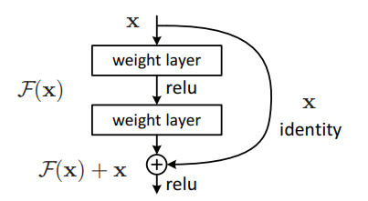
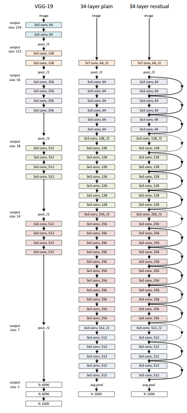
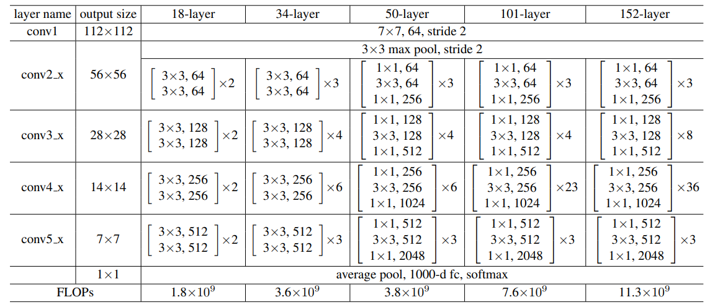
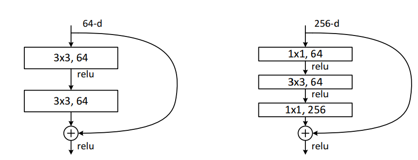

# ResNet

## Motivation

Network depth is crucial for the performance of a network. However, the deeper the network, the more difficult it is to train due the notorious problem of vanishing/exploding gradients. This is partially addresses by using normalized initialization and intermediate normalization layers.

When deeper networks are able to start converging, a degradation problem has been exposed: with the network depth increasing, accuracy gets saturated (which might be unsurprising) and then degrades rapidly. Unexpectedly, such degradation is not caused by overfitting, and adding more layers to a suitably deep model leads to higher training error.

The degradation (of training accuracy) indicates that not all systems are similarly easy to optimize. Let us consider a shallower architecture and its deeper counterpart that adds more layers onto it. There exists a solution by construction to the deeper model: the added layers are identity mapping, and the other layers are copied from the learned shallower model. The existence of this constructed solution indicates that a deeper model should produce no higher training error than its shallower counterpart. But experiments show that our current solvers on hand are unable to find these solutions.

### The Residual Connection

The authors found a better method to train deeper networks: the residual connection. The residual connection is a shortcut connection that skips one or more layers. It is a simple yet effective method to address the degradation problem in deep networks.

Mathematically, the what residual connection does is instead of laerning a function $\mathbb{F(x)}$, it learns a function $\mathbb{F(x)} + x$.

> We hypothesize that it is easier to optimize the residual mapping than to optimize the original, unreferenced mapping. To the extreme, if an identity mapping were optimal, it would be easier to push the residual to zero than to fit an identity mapping by a stack of nonlinear layers.

This can be realized by a shortcut connection that skips one or more layers, as shown in the figure below:

Note that the shortcut connection is like passing the input $x$ through a function and then adding it later. This connection can be any function, in the figure, we are adding the input directly meaning that it is an identity function. This is the simplest form of residual connection.

Using these residual blocks, the authors showed that:

1. The extremely deep residual nets are easy to optimize, but the counterpart “plain” nets (that simply stack layers) exhibit higher training error when the depth increases;
2. The deep residual nets can easily enjoy accuracy gains from greatly increased depth, producing results substantially better than previous networks

> The degradation problem suggests that the solvers might have difficulties in approximating identity mappings by multiple nonlinear layers. With the residual learning reformulation, if identity mappings are optimal, the solvers may simply drive the weights of the multiple nonlinear layers toward zero to approach identity mappings.

### A More Mathematical Treatment

The building block, shown in the figure above can be defined as:

$$
y = \mathbb{F}(x,W) + x
$$

The function $\mathbb{F}(x,W)$ represents the residual mapping to be learned. For the example in figure we have, $\mathbb{F} = W_2\sigma(W_1x)$

Note that the dimensions of $\mathbb{F}$ and $x$ must match. If it is not the case, the dimensions can be equated by using a linear projection $W_s$.

$$
y = \mathbb{F}(x,W) + W_sx
$$

> We can use a square matrix $W_s$ even when the dimensions do not match. However, the authors showed that this is not necsessary and using idenity matrix is sufficient.

> The number of layers inside a residual block can be anything. However, if the number of blocks is 1, this is equivalent to a plain network and is not beneficial. Using more than 2 layers did not resulted in any improvement.

## Architectures

### Plane Networks

The convolutional layers mostly have 3×3 filters and follow two simple design rules:

- (i) for the same output feature map size, the layers have the same number of filters; and
- (ii) if the feature map size is halved, the number of filters is doubled so as to preserve the time complexity per layer.

We perform downsampling directly by convolutional layers that have a stride of 2. The network ends with a global average pooling layer and a 1000-way fully-connected layer with softmax. The total number of weighted layers is 34.

> Note that even this 34 layered model has less operations than VGG.

### Residual Networks

The authors turned the above mentioned plain network into a residual network by adding residual connections. The identity shortcuts can be directly used when the input and output are of the same dimensions (solid line shortcuts in figure below). When the dimensions increase (dotted line shortcuts in figure below), we consider two options:

- (A) The shortcut still performs identity mapping, with extra zero entries padded for increasing dimensions. This option introduces no extra parameter;
- (B) The projection shortcut is used to match dimensions (done by 1×1 convolutions). For both options, when the shortcuts go across feature maps of two sizes, they are performed with a stride of 2.

> We adopt batch normalization (BN) right after each convolution and before activation, following. We initialize the weights using Glorot initialization and train all plain/residual nets from scratch. We use SGD with a mini-batch size of 256. The learning rate starts from 0.1 and is divided by 10 when the error plateaus, and the models are trained for up to 60 × 104 iterations. We use a weight decay of 0.0001 and a momentum of 0.9. We do not use dropout.

The authors tried a number of model variations. Some of them are given below:

#### Residual

They use identity mapping for all shortcuts and zero-padding for increasing dimensions. So they have no extra parameter compared to the plain counterparts. Numbers of layers are 18 and 34. (ResNet-A)

#### Indentity vs Projection

Next, they compare three models:

1. Zero-padding shortcuts are used for increasing dimensions, and all shortcuts are parameter free. (Same as ResNet-A)
2. Projection shortcuts are used for increasing dimensions, and other shortcuts are identity mapping. (ResNet-B)
3. All shortcuts are projection shortcuts. (ResNet-C)

They found that:

> B is slightly better than A. We argue that this is because the zero-padded dimensions in A indeed have no residual learning. C is marginally better than B, and we attribute this to the extra parameters introduced by many (thirteen) projection shortcuts. But the small differences among A/B/C indicate that projection shortcuts are not essential for addressing the degradation problem. So we do not use option C in the rest of this paper.

#### Deeper Bottleneck Architecture

To avoid higher training time and memory consumption, the authors used a bottleneck architecture. The bottleneck architecture is a 1×1 convolution that reduces the number of input feature maps, followed by a 3×3 convolution, and then another 1×1 convolution that increases the number of output feature maps.

> The parameter-free identity shortcuts are particularly important for the bottleneck architectures. If the identity shortcut in figure above (right) is replaced with projection, one can show that the time complexity and model size are doubled, as the shortcut is connected to the two high-dimensional ends. So identity shortcuts lead to more efficient models for the bottleneck designs.

#### 50-layer ResNet

They replaced 2-layer block in the 34-layer net with 3-layer bottleneck block which results in 50-layer net. This model is called ResNet-50. They used the second option for increasing dimensions.

#### 101-layer and 152-layer ResNets

They constructed these by increasing the number of bottleneck blocks in the 50-layer net. Remarkably, although the depth is significantly increased, the 152-layer ResNet (11.3 billion FLOPs) still has lower complexity than VGG-16/19 nets (15.3/19.6 billion FLOPs). The 50/101/152-layer ResNets are more accurate than the 34-layer ones by considerable margins.

## Implementations

Here, we are going to give some details about which model to implement. We are making some simplifications. First, I'm not using the batch normalization. Second, not all the models are going to be implemented.

The models going to be implemented are:

### The Plain Network (`plain`)

This is the plain network with 3×3 convolutions and 2×2 max pooling. The number of layers are 18 and 34 as discussed above. The names are going to be `plain18` and `plain34`.

### Residual Networks A (`resnetA`)

This is for the model where zero-padding shortcuts are used for increasing dimensions, and all shortcuts are parameter free. The numbers of layers are 18 and 34. The model has name `resnetA18` and `resnetA34`.

Note that model with layers more than 34 uses bottleneck architecture and it uses the second option for increasing dimensions so, by definition, it is not `resnetA`.

### Residual Networks B (`resnetB`)

This is for the model where projection shortcuts are used for increasing dimensions, and other shortcuts are identity mapping. The numbers of layers are 18, 34, 50, 101, 152. The model has name `resnetB18`, `resnetB34`, `resnetB50`, `resnetB101`, `resnetB152`.

For models with more than 34 layers, the bottleneck architecture is used.

> The C-series models are not implemented.
