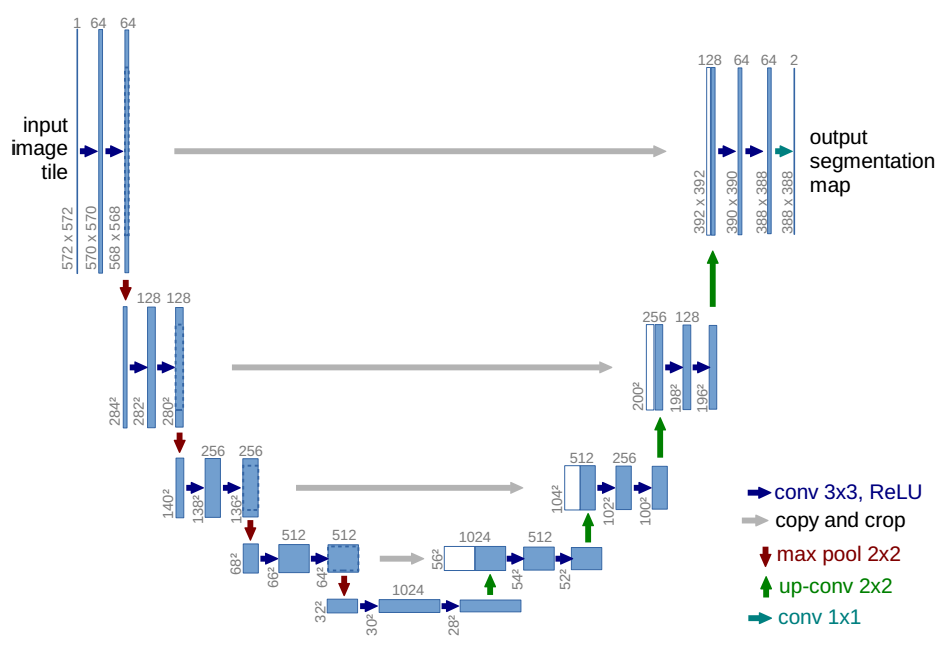

# UNet

## Introduction

Convolautional neural networks work great with classification tasks. However, in many visual tasks, especially in biomedical image processing, the desired output should include localization, i.e., a class label is supposed to be assigned to each pixel. CNNs can be used in such type of jobs too. The UNet is an architecture for such a task.

## Architecture Details

The main idea is to supplement a usual contracting network by successive layers, where pooling operators are replaced by upsampling operators. Hence, these layers increase the resolution of the output.

In the upsampling part the authors have also a large number of feature channels, which allow the network to propagate context information to higher resolution layers. As a consequence, the expansive path is more or less symmetric to the contracting path, and yields a U-shaped architecture. The network does not have any fully connected layers and only uses the valid part of each convolution.

The architecture of UNet. This consists of two parts: the contracting path and the expansive path. The contracting path is a typical CNN architecture, which is used to extract features from the input image. The expansive path is a series of upsampling layers, which is used to upsample the feature maps from the contracting path and combine them with the corresponding feature maps from the contracting path. The final output is a segmentation map.

The authors used excessive data augmentation to train the network considering that data for image segmentation is scarce.

The contracting path follows the typical architecture of a convolutional network. It consists of the repeated application of two 3x3 convolutions (unpadded convolutions), each followed by a rectified linear unit (ReLU) and a 2x2 max pooling operation with stride 2 for downsampling. At each downsampling step we double the number of feature channels. Every step in the expansive path consists of an upsampling of the feature map followed by a 2x2 convolution (\up-convolution") that halves the number of feature channels, a concatenation with the correspondingly cropped feature map from the contracting path, and two 3x3 convolutions, each followed by a ReLU.

> The cropping is necessary due to the loss of border pixels in every convolution. At the final layer a 1x1 convolution is used to map each 64- component feature vector to the desired number of classes. In total the network has 23 convolutional layers.

Due to the unpadded convolution, the output of the network is smaller than the input. The authors used the cross-entropy loss for training. Output is a softmax over each pixel.

## Implementation Details

Here, we will implement the UNet with some minor modifications:

1. The conv layers in the contracting path are replaced by the ConV2d Transpose layers. This makes the network symmetric and the input and output size are the same.
