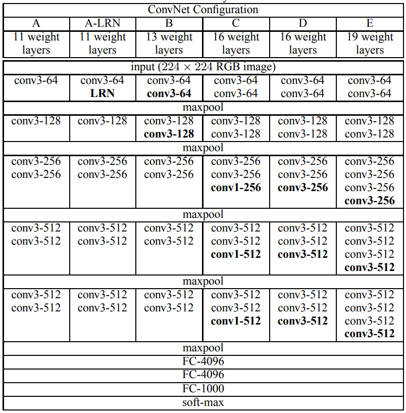
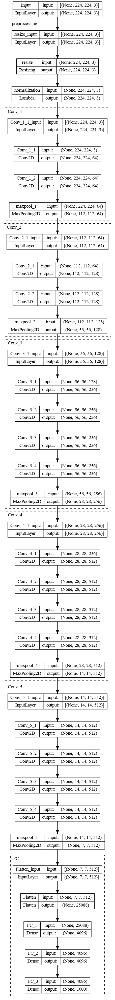

# VGG

## The Architecture

The paper discusses the effect of the depth of the network on the accuracy of the network. For that, they fixed other parameters of the architecture, and steadily increase the depth of the network by adding more convolutional layers, which is feasible due to the use of very small ($3\times 3$) convolution filters in all layers.

### The Convolutional Layers

The image is passed through a stack of convolutional (conv.) layers, where we use filters with a very small receptive field: 3 × 3 (which is the smallest size to capture the notion of left/right, up/down, center). In one of the configurations we also utilise 1 × 1 convolution filters, which can be seen as a linear transformation of the input channels (followed by non-linearity). The convolution stride is fixed to 1 pixel; the spatial padding of conv. layer input is such that the spatial resolution is preserved after convolution, i.e. the padding is 1 pixel for 3 × 3 conv. layers. Spatial pooling is carried out by five max-pooling layers, which follow some of the conv. layers (not all the conv. layers are followed by max-pooling). Max-pooling is performed over a 2 × 2 pixel window, with stride 2.

### The Fully-Connected Layers

This is followed by two fully-connected (fc.) layers with 4096 units each. The last fc. layer is a softmax layer with 1000 units (corresponding to the 1000 ImageNet object categories). The network is trained by minimizing the multi-class cross-entropy loss.

## Some Discussion

Instead of using large kernels, the authors used small kernels. It can be shown that two small 3x3 kernels have the same receptive field as a single 5x5 kernel. Also, three 3x3 kernels gives the recpective area equal to 7x7. So, why not use just on 7x7 kerneel instead of three 3x3 kernels? The authors tells:

> First, we incorporate three non-linear rectification layers instead of a single one, which makes the decision function more discriminative. Second, we decrease the number of parameters.

The authors also used 1x1 convolutional layers. They did not used this to change the number of channels (as in the case of Inception), but to perform a linear transformation of the input channels.

> Even though in our case the 1x1 convolution is essentially a linear projection onto the space of the same dimensionality (the number of input and output channels is the same), an additional non-linearity is introduced by the rectification functio

### Training

They use the cross entropy as loss function and use mini-batch gradient descent with momentum (same as AlexNet).
The batch size was set to 256, momentum to 0.9. The training was regularised by weight decay (the $L_2$ penalty multiplier set to $5\times 10^{-4}$ ) and dropout regularisation for the first two fully-connected layers (dropout ratio set to 0.5). The learning rate was initially set to $10^{-2}$ , and then decreased by a factor of 10 when the validation set accuracy stopped improving. In total, the learning rate was decreased 3 times, and the learning was stopped after 370K iterations (74 epochs).

As for the initialization, they began with training the configuration A (Second Figure), shallow enough to be trained with random initialisation. Then, when training deeper architectures, they initialised the first four convolutional layers and the last three fullyconnected layers with the layers of net A (the intermediate layers were initialised randomly). They did not decrease the learning rate for the pre-initialised layers, allowing them to change during learning. For random initialisation (where applicable), they sampled the weights from a normal distribution with the zero mean and $10^{-2}$ variance. The biases were initialised with zero.

Later, they found that using Glorot initialization works better.

> The augmentation of images were donw similar to that of AlexNet.

### Training Image Size

A number of methods were used for the training image size. First was to use one or two image sizes while training and the second was to the multi-scale where the image saize is set randomly in a range. The authors found that the multi-scale training works better.

At test time, they changes the fully connected layers to 1x1 conv layer. The resulting fully-convolutional net is then applied to the whole (uncropped) image. The result is a class score map with the number of channels equal to the number of classes, and a variable spatial resolution, dependent on the input image size. Finally, to obtain a fixed-size vector of class scores for the image, the class score map is spatially averaged (sum-pooled). We also augment the test set by horizontal flipping of the images; the soft-max class posteriors of the original and flipped images are averaged to obtain the final scores for the image.

> For more details about training image size and the performances of the model, refer to the article. A brief overview will be given below.

## Different Architectures: Implementations

### Some Simplifications

We are doing some of the simplifications we did when we implemented the AlexNet. VGG does not need a lot of changes, however, we'll drop the model A-LRN, which uses LRN layer. Everything else should be the same.

The following image shows the architecture (as implemented in TensorFlow) of VGG E model, also known as VGG-19. The model has 143,667,240 parameters.

